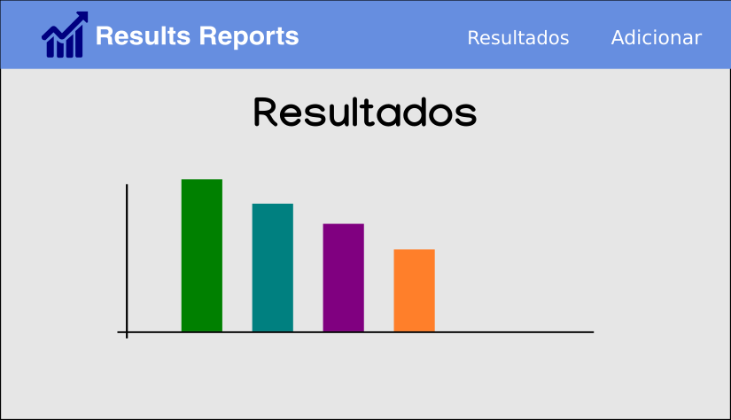

# DashBoard

-> A frontend project that will use chart.js render framework with custom themes.

## Steps Project
- [ ] Assemble initial structure
- [ ] Create Json-Server
- [ ] Add Chart.js
- [ ] Create dark/light themes